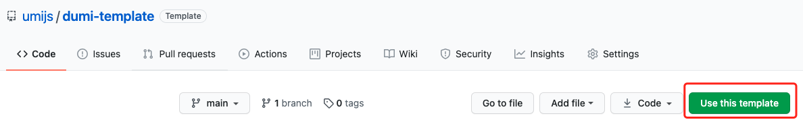

# 🌟 Dumi Template

A Umi-based doc template can assist you to develop libraries & write docs.

English | [简体中文](./README.zh-CN.md)

## 🚀 How to use?



## ✨ Online preview

https://umijs.github.io/dumi-template/

## 📒 Catalog Introduction

```
├── docs                   Component documentation
│   ├── index.md           Home page
│   └── **.**              Site Directory Document
├── src                    Component home directory
│   ├── index.ts           Component registration
│   └── Foo                Component development
├── .eslintrc.js           eslint config
├── .fatherrc.ts           father config
├── .umirc.ts              dumi config
└── tsconfig.json          typescript config
```

The rest of the documents can be consulted by yourself.

## 🤖 Command introduction

| Name                    | Description               | Remarks                                                                                                            |
| ----------------------- | ------------------------- | ------------------------------------------------------------------------------------------------------------------ |
| `npm run start`         | Project begining          | Document usage [dumi](https://github.com/umijs/dumi), component development and documentation development together |
| `npm run test`          | Component test            | -                                                                                                                  |
| `npm run test:coverage` | Code coverage review      | -                                                                                                                  |
| `npm run prettier`      | Code prettier             | -                                                                                                                  |
| `npm run build`         | Component packaging       | Use [father](https://github.com/umijs/father)                                                                      |
| `npm run release`       | Component package release | -                                                                                                                  |
| `npm run docs:build`    | Document packaging        | -                                                                                                                  |
| `npm run docs:deploy`   | Document release          | The default is to use GitHub Pages                                                                                 |
| `npm run deploy`        | Document package release  | -                                                                                                                  |

## Who are using dumi?

<table>
  <tbody>
    <tr>
      <td align="center">
        <a target="_blank" href="https://umijs.org">
          
          <br>
          <strong>UmiJS</strong>
        </a>
      </td>
      <td align="center">
        <a target="_blank" href="https://ahooks.js.org/">
          
          <br>
          <strong>ahooks</strong>
        </a>
      </td>
      <td align="center">
        <a target="_blank" href="https://procomponents.ant.design/">
          
          <br>
          <strong>Pro Components</strong>
        </a>
      </td>
      <td align="center">
        <a target="_blank" href="https://github.com/react-component">
          
          <br>
          <strong>react-component</strong>
        </a>
      </td>
      <td align="center">
        <a target="_blank" href="https://ggeditor.com">
          
          <br>
          <strong>GGEditor</strong>
        </a>
      </td>
    </tr>
    <tr>
      <td align="center">
        <a target="_blank" href="https://remaxjs.org">
          
          <br>
          <strong>Remax</strong>
        </a>
      </td>
      <td align="center">
        <a target="_blank" href="https://lightproxy.org">
          
          <br>
          <strong>LightProxy</strong>
        </a>
      </td>
      <td align="center">
        <a target="_blank" href="https://juejin-im.github.io/open-source/">
          
          <br>
          <strong>juejin-im</strong>
        </a>
      </td>
    </tr>
  </tbody>
</table>

### README Badge

Using dumi ? Add a README badge to show it off: [](https://github.com/umijs/dumi)

```
[](https://github.com/umijs/dumi)
```

## Discuss group

<div>
  
  
</div>
